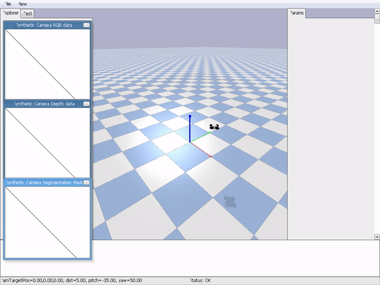
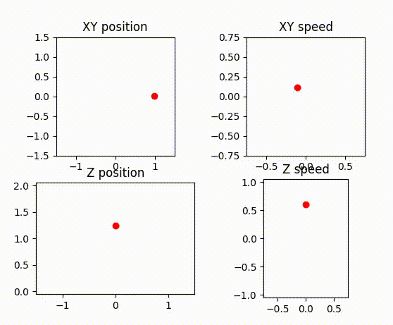
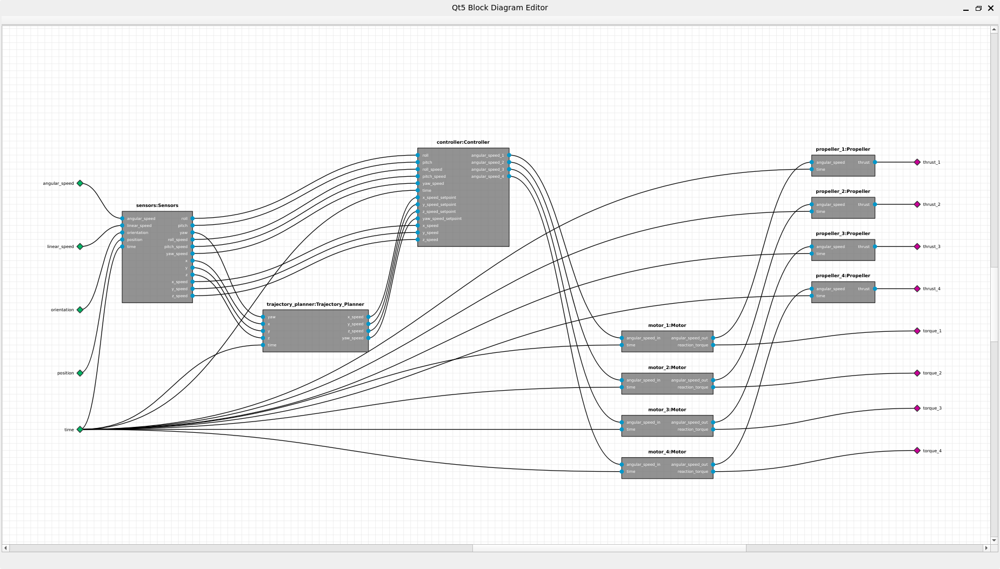

- [Introduction](#introduction)
  - [Advantages](#advantages)
- [Quick Start](#quick-start)
  - [Configuration](#configuration)
- [Overview](#overview)
- [Tags](#tags)
- [Improvement Areas](#improvement-areas)
- [Contributing](#contributing)
  - [Ways to Contribute](#ways-to-contribute)
  - [Contribution Workflow](#contribution-workflow)
  - [Contributor Acknowledgment](#contributor-acknowledgment)
- [License](#license)

# Introduction

This project demonstrates how to design an autonomous multirotor model and simulate it using a component-based environment built with Python (hence, purely text-based).

## Advantages

The advantages of the component-based approach are well known:

1. **Modularity**: Simplifies system design by breaking it into smaller, reusable components.
    *   **Flexibility**: Allows easy modification or replacement of individual components without affecting the entire system.
    *   **Functional Allocation**: Enables the allocation of configuration, functionalities, and behaviors to specific components.
    *   **Interfacing**: Highlights the separation between functionalities and interfaces.
2. **Early Validation**: Enables real-time simulation, testing, and validation of the system's behavior before physical implementation.
3. **Cost Efficiency**: Reduces development costs by identifying and addressing issues early in the design phase.
4. **Scalability**: Facilitates the addition of new features or components as the system evolves.
5. **Interdisciplinary Collaboration**: Promotes collaboration by providing a clear structure for integrating contributions from different domains.
6. **Code Generation**: Automates the creation of boilerplate and target-specific code from high-level behavioral descriptions, reducing manual effort and ensuring consistency across components.
7. **Simulation of Target-Specific Code**: Allows the import and simulation of code taken from real-world targets.
8. **Project Management**: Streamlines configuration, documentation generation, and overall project organization, making it easier to manage complex systems.

# Quick Start

A Docker image providing the source code included in this repository and all needed dependencies is available on Docker Hub. It can be launched, if, for instance, you use Docker Desktop, with the following commands:

```text
systemctl --user start docker-desktop
docker pull openformatproj/multirotor:latest
docker run -it openformatproj/multirotor:latest
```

Once launched, you can execute the `run.py` script from the container:

```text
/workspaces/multirotor# python run.py simulate
```

This script builds the multirotor architecture, initializes it and starts the simulation timer. The execution should produce the following result:


<p align="center">Figure 1: Multirotor simulation - 3D rendering (PyBullet)</p>


<p align="center">Figure 2: Multirotor simulation - Position plot (matplotlib)</p>

The content of this repository is available in the `/workspaces/multirotor/src` folder of the Docker image.

## Configuration

A `src/sim_conf.py` file must be available. This is an example:

```python
from math import cos, sin
from ml.data import register_data_type, Number

# --- Numerical Backend Configuration ---
register_data_type(Number)
# Sets the numerical computation backend. Options: `Number.NUMPY` (fastest), `Number.FLOAT`, `Number.DECIMAL`.
NUMBER_IMPLEMENTATION = Number.NUMPY
# Sets the precision for calculations if `NUMBER_IMPLEMENTATION` is `Number.DECIMAL`.
DECIMAL_CONTEXT_PRECISION = 4

# --- Simulation Execution Configuration ---
# If `True`, the simulation fails if it cannot keep up with the wall-clock time defined by `TIME_STEP`.
REAL_TIME_SIMULATION = False
# If `True`, increases the OS process priority to reduce scheduling jitter, crucial for `REAL_TIME_SIMULATION`.
HIGH_PRIORITY = False
# Sets how to parallelize parts meant to be executed concurrently. Options: `'thread'`, `'process'`.
PARALLEL_EXECUTION_MODE = 'thread'

# --- Visualization and Debugging ---
# If `True`, runs the PyBullet simulation with a graphical user interface. `False` runs in headless mode.
GUI = False
# If `True`, enables the real-time `matplotlib` server for plotting position and speed.
PLOT = True
# A factor to reduce the number of points sent to the plotter (e.g., `10` means 1 out of every 10 points is plotted).
PLOT_DECIMATION = 10
# If `True`, activates detailed performance and dataflow logging for analysis.
TRACER_ENABLED = False

# --- Initial State Configuration ---
# The starting `[x, y, z]` position of the multirotor in the simulation world.
INITIAL_POSITION = [1, 0, 1]
# The starting `[roll, pitch, yaw]` orientation of the multirotor.
INITIAL_ROTATION = [0, 0, 0]

# --- Trajectory and Plotting Parameters ---
# Parameters defining the shape of the default helical trajectory.
w = 0.5  # `w`: xy angular speed in rad/s
q = 1.0  # `q`: z angular speed in rad/s
a = 0.7  # `a`: z amplitude in rad/s
graph_margin = 1.5

# A function that defines the target position of the multirotor over time `t`.
def SET_POSITION(t):
    return [cos(w * t), sin(w * t), 1 + a * sin(q * t)]
# A function that defines the target speed of the multirotor over time `t`.
def SET_SPEED(t):
    return [w * (-sin(w * t)), w * cos(w * t), a * q * cos(q * t)]
# Defines the fixed axis limits for the position plot.
POSITION_GRAPH_BOUNDARIES = [(-1 * graph_margin, 1 * graph_margin), (-1 * graph_margin, 1 * graph_margin), ((1 - a * graph_margin), (1 + a * graph_margin))]
# Defines the fixed axis limits for the speed plot.
SPEED_GRAPH_BOUNDARIES = [(-w * graph_margin, w * graph_margin), (-w * graph_margin, w * graph_margin), (-a * q * graph_margin, a * q * graph_margin)]
```

In this case, the multirotor is configured to follow a circular trajectory around the origin.

`src/sim_conf.py` is not tracked by Git, allowing you to customize simulation parameters without modifying the core configuration.

# Overview

The idea in this case is to define the behavior of bottom-level components (motors, propellers, sensors, the trajectory planner, and the controller), build a multirotor model by attaching their ports together, connect such a model to a simulator, and run it.

<p id="figure-3"/>


<p align="center">Figure 3: Multirotor model structure</p>

<a href="#figure-3">Figure 3</a> shows the high-level structure of the `Multirotor` model (the diagram has been generated with [openformatproj/diagrams](https://github.com/openformatproj/diagrams)). The `Top` component encapsulates the `Multirotor` model and the `Rigid_Body_Simulator`. The entire simulation is driven by an external `Timer` (an `EventSource`), which provides time-tick events to the `Top` part. This event-driven approach ensures that the simulation only executes when a time step is required.

Here's a snippet of how the environment is built at the code level (`src/description.py`):

```python
# Import dependencies

class Multirotor(Part):
    def __init__(self, identifier: str, conf: object, execution_strategy=sequential_execution):
        ports = [
            Port(TIME_PORT, Port.IN),
            Port(POSITION_PORT, Port.IN),
            Port(ORIENTATION_PORT, Port.IN),
            Port(LINEAR_SPEED_PORT, Port.IN),
            Port(ANGULAR_SPEED_PORT, Port.IN)
        ]
        parts = {
            SENSORS_ID: Sensors(SENSORS_ID),
            TRAJECTORY_PLANNER_ID: Trajectory_Planner(TRAJECTORY_PLANNER_ID, conf),
            CONTROLLER_ID: Controller(CONTROLLER_ID, PROPELLERS_INDEXES, conf=conf, execution_strategy=execution_strategy)
        }
        for i in PROPELLERS_INDEXES:
            ports.append(Port(THRUST_PORT_TPL.format(i), Port.OUT))
            ports.append(Port(TORQUE_PORT_TPL.format(i), Port.OUT))
            parts[MOTOR_ID_TPL.format(i)] = Motor(MOTOR_ID_TPL.format(i))
            direction = Propeller.LEFT_HANDED if i in [2, 4] else Propeller.RIGHT_HANDED
            parts[PROPELLER_ID_TPL.format(i)] = Propeller(PROPELLER_ID_TPL.format(i), direction)
            
        super().__init__(
            identifier=identifier,
            execution_strategy=sequential_execution,
            ports=ports,
            parts=parts,
            conf=conf
        )
        
        # Connect time, position, orientation, etc. to inner parts

class Rigid_Body_Simulator(Part):
    # Initialize the simulator with a PyBullet engine instance

    def behavior(self):
        if all(p.is_updated() for p in self.thrust_ports) and all(p.is_updated() for p in self.torque_ports):
            for i, (thrust_port, torque_port) in enumerate(zip(self.thrust_ports, self.torque_ports)):
                thrust = thrust_port.get()
                torque = torque_port.get()
                self.engine.applyExternalForce(self.multirotor_avatar, i, thrust, [0, 0, 0], self.engine.LINK_FRAME)
                self.engine.applyExternalTorque(self.multirotor_avatar, i, torque, self.engine.LINK_FRAME)

            self.engine.stepSimulation()

        position, orientation = self.engine.getBasePositionAndOrientation(self.multirotor_avatar)
        self.get_port(MULTIROTOR_POSITION_PORT).set(position)
        self.get_port(MULTIROTOR_ORIENTATION_PORT).set(orientation)
        linear_speed, angular_speed = self.engine.getBaseVelocity(self.multirotor_avatar)
        self.get_port(MULTIROTOR_LINEAR_SPEED_PORT).set(linear_speed)
        self.get_port(MULTIROTOR_ANGULAR_SPEED_PORT).set(angular_speed)

    def __init__(self, identifier: str, conf: object):
        ports = [
            Port(TIME_PORT, Port.IN),
            Port(MULTIROTOR_POSITION_PORT, Port.OUT),
            Port(MULTIROTOR_ORIENTATION_PORT, Port.OUT),
            Port(MULTIROTOR_LINEAR_SPEED_PORT, Port.OUT),
            Port(MULTIROTOR_ANGULAR_SPEED_PORT, Port.OUT)
        ]
        for i in PROPELLERS_INDEXES:
            ports.append(Port(MULTIROTOR_THRUST_PORT_TPL.format(i), Port.IN))
            ports.append(Port(MULTIROTOR_TORQUE_PORT_TPL.format(i), Port.IN))
        super().__init__(identifier=identifier, ports=ports, conf=conf, scheduling_condition=lambda part: part.get_port(TIME_PORT).is_updated())
        self.engine = None
        self.multirotor_avatar = None
        self.thrust_ports = [self.get_port(MULTIROTOR_THRUST_PORT_TPL.format(i)) for i in PROPELLERS_INDEXES]
        self.torque_ports = [self.get_port(MULTIROTOR_TORQUE_PORT_TPL.format(i)) for i in PROPELLERS_INDEXES]

class Top(Part):
    # Define an initialization hook that connects to the PyBullet physics engine and a termination hook to disconnect

    def __init__(self, identifier: str, conf: object, execution_strategy=sequential_execution, controller_execution_strategy=sequential_execution):
        self.engine = None
        event_queues = [EventQueue(TIME_EVENT_IN_Q, EventQueue.IN, size=1)]
        parts = {
            TIME_DIST_ID: EventToDataSynchronizer(
                TIME_DIST_ID,
                input_queue_id=TIME_EVENT_IN_Q,
                output_port_id=TIME_OUT_PORT
            ),
            SIMULATOR_ID: Rigid_Body_Simulator(SIMULATOR_ID, conf=conf),
            MULTIROTOR_ID: Multirotor(MULTIROTOR_ID, execution_strategy=controller_execution_strategy)
        }
        super().__init__(
            identifier=identifier,
            execution_strategy=execution_strategy,
            parts=parts,
            event_queues=event_queues,
            conf=conf
        )
        
        time_dist = self.get_part(TIME_DIST_ID)
        simulator = self.get_part(SIMULATOR_ID)
        multirotor = self.get_part(MULTIROTOR_ID)

        self.connect_event_queue(self.get_event_queue(TIME_EVENT_IN_Q), time_dist.get_event_queue(TIME_EVENT_IN_Q))
        
        # Connect time, position, orientation, etc. to simulator and multirotor

        # Add hooks to self
```

As it's possible to understand, `class Multirotor` defines its ports, the parts it's composed of (motors, propellers, sensors, the trajectory_planner and the controller) and their connections. All these parts are further defined in their specific subfolders, such as `./motor`, `./propeller`, and so on. This kind of description is called *structural* and allows building hierarchies. `class Rigid_Body_Simulator` provides instead an example of *behavioral* description:

* Whenever time port is updated, position, orientation and their derivatives are extracted from the simulation environment (specifically, from the multirotor avatar) and sent on output ports.
* When, moreover, thrusts and torques are updated by the multirotor model, they are applied to the avatar and the simulation engine is stepped.

`class Top` finally aggregates the simulator and the multirotor model. It is driven by an external `Timer` (an `EventSource`) that provides time events. This allows running a "real time" simulation, provided that all computations are able to terminate within the timer's period. To perform the simulation, one can instantiate these components and run them in separate threads.
The `Timer`'s `on_full` policy is critical. Using `OnFullBehavior.FAIL` (as shown below) enforces strict real-time execution by stopping the simulation if a deadline is missed. This is the recommended mode for validating system performance. The alternative, `OnFullBehavior.OVERWRITE`, allows the simulation to continue by dropping events, which can be useful for non-critical analysis.

```python
top = Top('top', execution_strategy=parallel_toplevel_execution, controller_execution_strategy=parallel_controller_execution)
top.init()

on_full_behavior = OnFullBehavior.FAIL if conf.REAL_TIME_SIMULATION else OnFullBehavior.DROP
timer = Timer(identifier='physics_timer', interval_seconds=conf.TIME_STEP, on_full=on_full_behavior)

top.connect_event_source(timer, 'time_event_in')

top.start(stop_condition=lambda p: timer.stop_event_is_set())
timer.start()
top.wait()
timer.stop()
timer.wait()
top.term()
```

This is exactly what the script `run.py` available in the Docker image does by calling the function `simulate()` in `src/runs.py`.

For more information about the ml engine, read the [documentation](https://openformatproj.github.io/ml-docs/).

# Tags

`python`, `simulation`, `multirotor`, `drone`, `robotics`, `component-based`, `autonomous-systems`, `control-systems`, `MBSE`, `model-based-systems-engineering`, `systems-engineering`

# Improvement Areas

While the project demonstrates a functional simulation of a multirotor, there are several areas for potential improvement:

1. **Better Modeling of Sensors**: Enhance the accuracy and realism of sensor models (radio-altimeters, GNSS, INS, LIDARs, proximity sensors and so on).
2. **Better Modeling of Actuators (Motors and Propellers)**: Enhance the precision and reliability of actuator models.
3. **Creation of a More Detailed Simulation Environment**: Develop a richer and more complex simulation environment to test the multirotor in diverse scenarios.
4. **Advanced Autonomy and AI Integration**: Explore advanced capabilities for autonomous navigation and decision-making. This includes:
    *   **Adaptive Trajectory Planning**: Implement trajectory planning based on local features and real-time sensor data (e.g., using LIDAR or cameras) for dynamic obstacle avoidance and navigation in complex environments.
        *   *Technologies*: Consider leveraging libraries like `OpenCV` for visual feature extraction, `PyLIDAR` (or similar) for LIDAR data processing, and path planning algorithms (e.g., A*, RRT*, D*) potentially integrated with robotics frameworks like `ROS` (Robot Operating System) with its Python bindings (`rospy`, `rclpy`).
    *   **Reinforcement Learning**: Develop and apply reinforcement learning techniques for learning optimal control policies, adaptive flight maneuvers, or complex mission execution.
        *   *Technologies*: Explore frameworks such as `TensorFlow (TF-Agents)`, `PyTorch (TorchRL)`, `Stable Baselines3`, or `Ray (RLlib)`.
    *   **Machine Vision & Perception**: Integrate advanced machine vision for tasks like object detection/classification (e.g., using YOLO, SSD, Faster R-CNN models), semantic segmentation, 3D reconstruction, visual odometry, and SLAM (Simultaneous Localization and Mapping).
        *   *Technologies*: Utilize `OpenCV`, `PyTorch`/`TensorFlow` for deep learning models, `Open3D` for 3D data processing, and libraries supporting various SLAM algorithms.
    *   **Advanced Sensor Fusion**: Implement sophisticated sensor fusion algorithms (e.g., Extended Kalman Filters (EKF), Unscented Kalman Filters (UKF), Particle Filters, Factor Graphs) to combine data from heterogeneous sensors (IMU, GNSS, cameras, LIDAR, radar) for robust and accurate state estimation, especially in challenging (e.g., GNSS-denied) environments.
        *   *Technologies*: Libraries like `FilterPy`, `NumPy`/`SciPy` for numerical backends, and potentially custom implementations or integrations with `ROS` message filters.
    *   **AI-Driven Mission Planning and Execution**: Develop higher-level cognitive functions for autonomous mission planning, dynamic replanning, task allocation, and complex decision-making under uncertainty.
        *   *Technologies*: Investigate AI planning techniques like PDDL (Planning Domain Definition Language) with Python parsers/solvers, Hierarchical Task Networks (HTNs) using libraries like `Pyhop`, or Behavior Trees (e.g., `py_trees`).
    *   **Swarm Intelligence and Multi-Agent Systems**: Extend the framework to simulate and coordinate multiple multirotors for collaborative tasks, exploring decentralized control strategies, formation flying, and distributed task allocation.
        *   *Technologies*: This could involve custom multi-agent simulation logic, or leveraging communication middleware like `ZeroMQ`, `MQTT`, or `ROS 2` for inter-agent communication.

# Contributing

We warmly welcome contributions to enhance this multirotor simulation project! Whether you're fixing a bug, adding a new feature, improving documentation, or suggesting new ideas, your input is valuable.

## Ways to Contribute

*   **Bug Reports**: If you find a bug, please open an issue detailing the problem, steps to reproduce, and your environment.
*   **Feature Requests**: Have an idea for a new feature or an improvement to an existing one? Open an issue to discuss it.
*   **Code Contributions**: Implement new features, fix bugs, or refactor code. See the [Improvement Areas](#improvement-areas) for inspiration.
*   **Documentation**: Improve code comments or add other explanatory documents.
*   **Testing**: Add or improve unit tests, integration tests, or simulation scenarios.

## Contribution Workflow

If you'd like to contribute code or documentation, please follow these general steps:

1.  **Discuss (for major changes)**: For significant changes (e.g., new core features, large refactors), please open an issue first to discuss your ideas. This helps ensure your efforts align with the project's direction and avoids duplicate work.
2.  **Fork the Repository**: Create your own fork of the project on GitHub.
3.  **Create a Branch**: Create a new branch in your fork for your feature or bug fix.
    ```bash
    git checkout -b your-descriptive-branch-name
    ```
4.  **Make Your Changes**: Implement your changes, adhering to any existing code style if possible.
5.  **Test Your Changes**: Ensure your changes work as expected and do not introduce new issues.
6.  **Commit Your Changes**: Write clear, concise commit messages.
7.  **Push to Your Fork**: Push your changes to your branch on your fork.
    ```bash
    git push origin your-descriptive-branch-name
    ```
8.  **Submit a Pull Request (PR)**: Open a pull request from your branch to the `master` (or main development) branch of the original repository. Provide a clear title and a detailed description of your changes, referencing any relevant issues.

## Contributor Acknowledgment

To ensure proper credit is given, here are some guidelines:

- **Acknowledgment**: Major contributors may be acknowledged in this section or other relevant parts of the documentation.
- **Commit History**: All contributions will be visible in the commit history of the repository.
- **Pull Request Description**: Please include your name or preferred alias in the pull request description if you'd like to be credited.
- **Issues and Discussions**: Active participation in issue discussions, providing feedback, and helping others are also valuable forms of contribution and may be acknowledged.

# License


This project is licensed under the [Apache License 2.0](https://www.apache.org/licenses/LICENSE-2.0). You are free to use, modify, and distribute this software, provided that you include proper attribution to the original author(s). Redistribution must retain the original copyright notice and this license.
